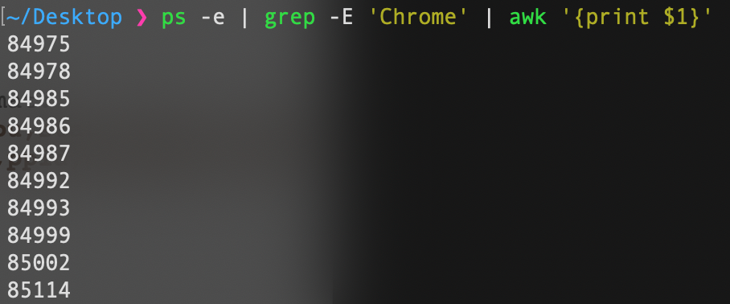

[__Back__](../README.md)

# A. BASH(Linux Shell)

## Processing texts

### 1. Count the number of lines statisfying a specific pattern in a log file

```sh
cat sample.txt | grep -i "Old" | wc -l
```

| | |
|-|-|
| cat | To view content of sample.txt |
|grep | To filter out line contains the word "Old". The parameter __-i__ means ignore word case which means old or Old or OLD would match the pattern|
| wc | Count numer of lines from the input |

### 2. Calculate KLOC of code C/C++ files in a directory

```sh
echo "$(find -E . -iregex '.*.(cpp|h|hpp)' | xargs cat | wc -l) 1000" | awk '{printf "%.2f\n", $1/$2}';
```

| | |
|-|-|
| find | Find all files match the pattern recursively from current directory.|
| | The parameter __-E__ is extended regex |
| | The parameter __-iregex__ is also like __-regex__ but ignore word case |
| | The pattern '.\*.\(cpp\|h\|hpp\)' is regex pattern which matches all files that have .cpp, .h or .hpp extension We can use __-maxdepth__ 1 to find files in current directory only |
| xargs | For every line from the input, execute command cat. In this situation, every file path from the previous command will be cat |
| awk | Map parameters seperate by whitespace from the input and run command inside the quotes.|

## System

### 1. Kill multiple processes following a pattern (using awk, grep, xargs)



```sh
ps -e | grep 'Chrome' | awk '{print $1}' | xargs kill
```

| | |
|-|-|
| ps | Display information of currect user active process. The parameter -e to see every process |
| awk | We can't run kill on awk command because no kill command in awk so we need use another way to use kill in awk but it hard to implement than using pipe with xargs |

### 2. Kill processes opening a specific port

```sh
lsof -t -i TCP:5000 | xargs kill
```

|||
|-|-|
| lsof | List all open files, on Linux everything is a file so we can now detech which process is running by listing all open files. |
|| The parameter -t means display id of the process open that files |
||The parameter -i means filter all processes any of whose Internet address matches the address specific with -i, if no address it means any address |

### 3. List opened ports, handles

```sh
lsof -i -P -n
```

|||
|-|-|
|lsof| The parameter -P inhibits conversion from port number to port name. |
| | The parameter -n inhibits conversion from address number to address name |

### 4. Find files via regular expression and remove them

```sh
find -E . -iregex '.*.(cpp|h)' | xargs rm
```

### 5. List, one at a time, all files larger than 100K in the /home/username directory tree. Give the user the option to delete or compress the file, then proceed to show the next one. Write to a logfile the names of all deleted files and the deletion times

```sh
find . -maxdepth 1 -size +100k | awk '{
    {print "What would you like to do with " $0}
    {print "1. Delete\n2. Compress"} 
    {getline choice < "/dev/tty"; 
    if (choice == 1) {
        system("rm \"" $0 "\""); 
        print strftime("%Y-%m-%d %H:%M:%S"),$0 >> "log.txt"} 
        else 
        {system("zip '\''"$0".archive.zip \" \"" $0 "\"")}
    }
}'
```

|||
|-|-|
| find | First list all files larger than 100KB to test result first |
| awk | Using awk scripting to give user which option user want, delete or compress |

## Shell scripting

```sh
#!/bin/sh

input=$1
output="0"

while IFS= read -r line
do
  output+="+${line}"
done < "$input"

result=$(echo $output | bc)
echo $result
```

|||
|-|-|
|while..done| With the redirect input < "$input" command, we can put the input file into the block "while...done"|

_What if we put the redirect input < "$input" in the read command?_

[__Back__](../README.md)