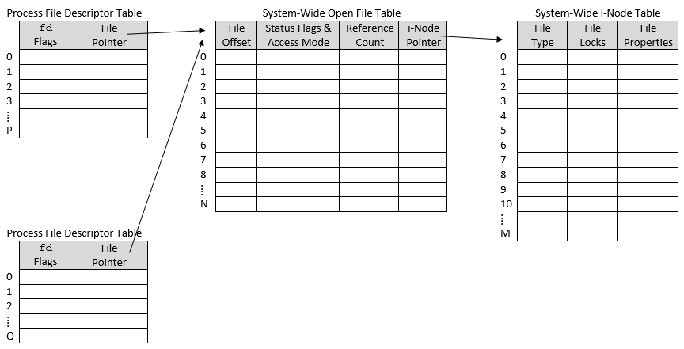
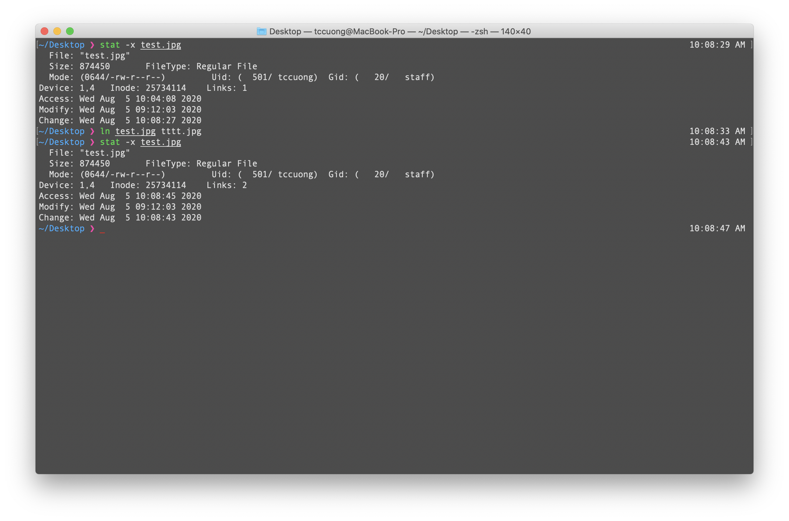
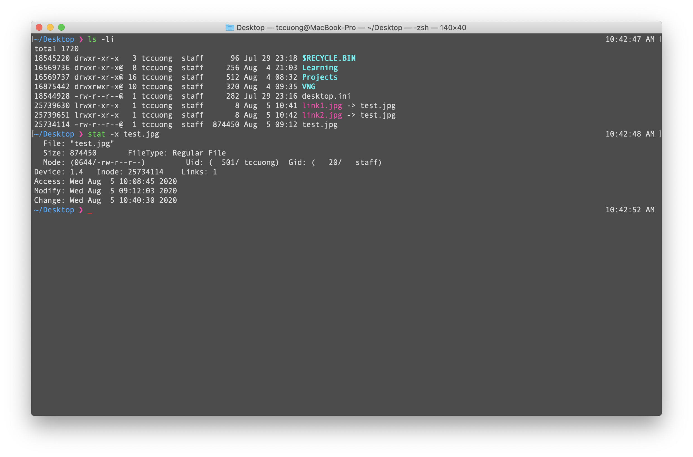

[__Back__](../README.md)

# B. Kiến thức về Linux System

## File and filesystem

### 1. _Everything is a file_

'Everything is a file' in Linux describes a feature in Unix-like system, that a wide range of input/output resources such as printers, hard-disks, modems, documents, directories, inter-process and network communications are simple stream of bytes exposed through filesystem name space; The big advantages of this approuch is that we can use the same tools, utilities and API for a wide range of resources. For example: we can use the same read/write API to read socket network data I/O with read() API rather than using WSARecv() in Windows.

1. __What is filesystem__

Linux provide a unified namespace that everything should access via the root mount point \(/\). In other operating systems, they might separate disks and drives into separate namespaces for example Windows, the hard drive contains operating system should be C:/ and other should be next alphabet's character like D:/ E:/ ...

A filesystem is a collection of files, directories in a formal and valid hierarchy. The first filesystem is mounted is located in the root of the namespace \(/\) and is called root filesystem.

2. __How the kernel maintains opening files and per-process opening files__

When you are trying to open a file, the kernel will create a new entry in a table called ___file table___, each entry in ___file table___ contains information about an open file such as the pointer to inode of a file in physical disk, metadata of that file including current position, access mode,... Each process in the system has it's own table called ___file descriptor table___ which contains ___non-negative integers___ and ___file pointer___ which is using to point to system-wide ___file table___ as we mentioned above.

Let's take a look at the picture below:




### 2. Regular files and special files

1. __Regular files__

- What most of us call _files_ are regular files in Linux. A regular file contains bytes of data, organized into an linear array called byte stream.
- The bytes may have any values, and they might be organized within a file in any way.
- Any of bytes in a file to be written to or read from, these operations start at a specific byte called _file position_. The file poisition is maintained in ___file table___ that the kernel is associated with. We can write bytes to a file position beyond the end of the file. When we first open a file, the _file position_ would be zero.

2. __Special files__

- Specials files are directories, sockets files, hard link files, character device files, block device files that are used for input or output resources operations. The special appear in the filesystem just as if regular files.

  - Directories which is treated as a file but we cannot open or read them. A directory contains information about the name and the pointer to inode of all files inside it.
  - Links divide into two types, symbolic links \(soft link or also called symlink\) and hard links.
  - When a character device file is used for device input/output, data is transfered one character a time (audio, graphics card, keyboard, mouse).
  - When a block device file is used for device input/output, data is transfered in form of block (storage devices).
  - Named pipes are files used to communicate with other processes on the same host, it only support one-way communication like only read or only write. If we want do so, we can open two pipes.
  - Sockets are an advanced form of IPC using to communicate between two processes, not only on the same machine but also on two different machine. Many sockets may have the same address but must be in difference port. Like regular file descriptor, socket also have a socket file descriptor.

|Hard links|Symbolic links|
|-|-|
|To resolve problem multiple names pointing to the same inode.|The hard link could not share to another filesystem because the current inode is meaningless in another filesystem.|
|When original file is deleted and is remaining one hard link file. the data will not be destroyed. To do that, the inode contains an information call _link count_ which is using to count the number of hard link pointing to this inode.| When original file is deleted, the link would be broken and inaccessible because the data of softlink is the path to the original file.
||
|When we first look at the picture below, we can see the link count is 2, one is the origin and one is hard link|The link count does not increase when creating softlink|
|__Question__: _What if we move one link file to another filesystem? And what if we move multiple hard link files to another filesystem?_|__Question__: _What if we move one  or more soft link to another filesystem?_|

## Process & Thread

### 1. What is process

- Process is an instance of a program that is being executed one one or many threads. It contains program code and it's activities.
- A thread is the unit of activity inside of the process.
- Each process is prepresented by a unique process 
identifier called process ID, abbreviated PID.


### 2. Memory layout of a process
|Memory layout|
|:-:|
|Stack|
|...|
|Heap|
|Data|
|Text|

1. __Text segment__

- Text segment contains executable instructions. This segment is read-only.
- Usually the text segment is sharedable so that only single needs copy in memory for frequently run for example text editor, C compiler.

2. __Data segment__

- Data segment contains global or static variables which have a pre-defined value.
- The data segment separate into two spaces, a read-only and read-write space.

3. __Stack__

- Stack is dovoted to store all data needed by function call. When a function is called, all local variable inside that function will be pushed into Stack.
- When a call inside a function is executed for example function A call function B, the offset of function A will be pushed to stack before jump to function B.

4. __Heap__

- The heap is the segment where dynamic memory allocation usually takes place.
- The allocation to the heap area occurs when allocating variable at run-time.
- It’s our responsibility to free memory on the heap. The objects on the heap lead to memory leaks if they are not freed. In garbage-collected languages, the garbage collector frees memory on the heap and prevents memory leaks.

### What is thread

- Thread is a component in a process which contains its own stack region and shares the same heap with the process, multiple threads can exist within one process, executing concurrently and sharing resources such as memory while different processes do not share resources.

- Systems with single thread generally implement multithreading by using _time slicing_, the processor switch between multiple threads called _context switching_.

- Systems with multiprocessor or multi-cores, multiple threads can run in parallel.

1. __POSIX Thread__

- A time ago, each manufacture developed their own thread API which is hard for developers to develop their multi-platform software because of multiple implementation of threads. POSIX Thread is a standard API to help developers solving that problem.

2. __Multithreading__

- One process exeuctes multiple threads called multithreading.
- In multiprocessors or multi-core systems, multithreading help the process run faster.
- __Problems__:
  - Complex debuging and testing.
  - Increase potential for deadlock.
  - Synchronize shared resources.
  - Unexpected result.
- __Race condition vs Deadlock__:
  - Deadlock occurs when _2 or more_ threads are waiting for each other to release the resource for inifinite amount of time -> The threads are in blocked and not executing.
  - Race condition occurs when _2 or more_ threads run in parallel but end up giving a result which is wrong answer if all the operations run in sequential. -> The threads are still running in parallel. 

Deadlock example:
|Thread T1|Thread T2|
|-|-|
|Lock A|Lock B|
|Do something|Do something|
|Want to access B|Want to access A|
|Waiting for B|Waiting for A|
|~~Release A~~|~~Release B~~|

Racecondition example:
|Thread T1|Thread T2|
|-|-|
|Read A||
||Read A|
||Write A|
|Write A||

- How to prevent race condition and deadlock
  - Race condition:
    - If data A must be consistent, lock resource A for writing before other read them.
  - Deadlock:
    - Always try to access resources in a particular order -> programmers must take care it themself.
    - Using a graph to detect and resolve deadlock -> hard to implement.
    - Using two phase locking.

### Synchronization

Semaphore is a variable used to control access to a common resource by multiple processes in a concurrent system such as a multitasking operating system

A semaphore contain a value and a list holding locked processes and two premitive:

```c
  struct Semaphore {
    int value;
    process* P;
  }

  Down(S) {
    S.value = S.value - 1;
    if (S.value < 0) {
      Add(P, S.L)
      Sleep()
    }
  }

  Up(S) {
    S.value = S.value + 1;
    if (S.value <= 0) {
      Remove(P, S.L);
      Wakeup();
    }
  }
```

|Semaphore|Mutex|
|-|-|
| Signaling machenism | Locking machenism |
| We can assign value to semaphore | Mutex is an object, could not assign value |
| Other process can change the value of a particular semaphore | Only owner can release the resources |

### Networking

1. __Blocking IO__

- With blocking IO, when a client makes a request connect to the server, the thread that handles that connection is blocked until there is some data to read.

- In this approuch, the relevant operations can do nothing but wait. So to handle multiple requests, each request must be handled in a thread.

2. __Non-blocking IO__

- With non-blocking IO, we can use single thread to handle multiple connections concurrently.

[__Back__](../README.md)