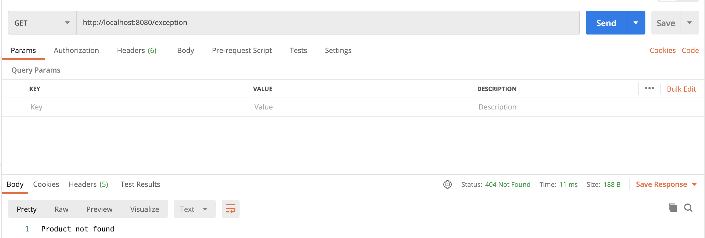

# Spring Exception Handler

The Spring Framework has its rich features and __Exception handler__ is not an exception, right.

## 1. Exception Class

```java
public class ProductNotFoundException extends RuntimeException {
    // Used to compare the version of the class to ensure that the same class was used during Serialization and Deserialization
    // You can ignore and leave them default.
    private static final long serialVersionUID = 1L;
}
```

## 2. Exception Controller Class

```java
@ControllerAdvice
public class ProductExceptionController {

    @ExceptionHandler(ProductNotFoundException.class)
    public ResponseEntity<Object> productNotFoundException() {
        return new ResponseEntity<>("Product not found", HttpStatus.NOT_FOUND);
    }
}
```

## 3. Test Rest Controller

```java
@RestController
@RequestMapping("/exception")
public class TestController {

    @GetMapping()
    public ResponseEntity<Object> get() {
        throw new ProductNotFoundException();
    }
}
```

## 4. Result

